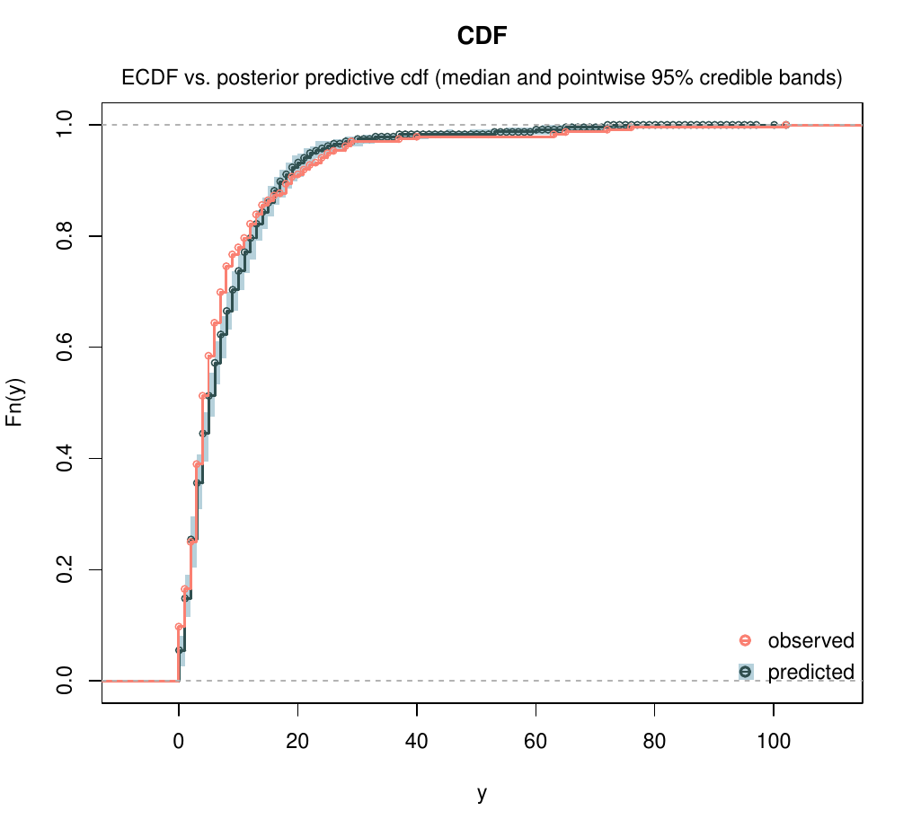
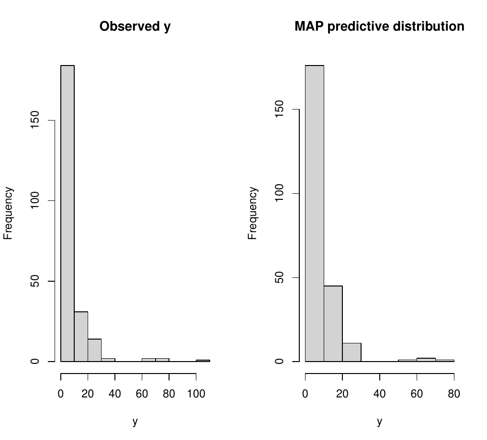
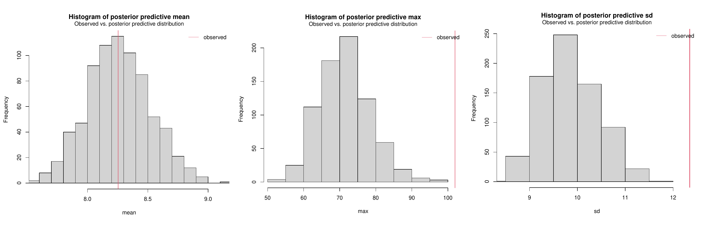

# `bpr` tutorial
## Basic usage

This tutorial is a short guide on the use of the `bpr` package to perform posterior sampling and inference on the parameters of Bayesian Poisson regression models.

In this part, just the basic usage is covered: additional tutorials are provided on the specific functionalities
* [tutorial_MCMC](tutorial_MCMC.md) : explains the use of MCMC parameters (tuning, burnin, thinning, multiple chains);
* [tutorial_prior](tutorial_prior.md) : explains the different prior distributions implemented;
* [tutorial_IS](tutorial_IS.md) : on the use of the importance sampler algorithm (instead of MH).

### Model specification
First, we briefly recall the model specification and prior distributions available in the package.
The general setting is that of standard Poisson regression models, where the interest is to regress a vector of counts *y*, of length *n*, on an *n x p* matrix *X* of covariates:

<p align="center">
y ~ Poisson( λ )
</p> <p align="center">
λ = exp{ X * β }
</p>

where β is a length-*p* vector of regression coefficients, and λ is the linear predictor (vector of length *n*).

On the regression coefficients we place conditionally Gaussian prior distributions: we assume that, conditionally on the mean vector *b* and covariance matrix *B*,
<p align="center">
( β | b, B ) ~ N( b, B ).
</p>

Implemented in this package are a straightforward Gaussian prior distribution with informative *(b,B)* fixed using prior information, and the horseshoe prior of Carvalho et al. (2010).
The horseshoe prior is a scale mixture of Gaussians where *b* is set to zero and the variance has a hierarchical representation:
<p align="center">
( β<sub>j</sub> | η<sub>j</sub><sup>2</sup>, τ<sup>2</sup> ) ~ N( 0, η<sup>2</sup> τ<sup>2</sup> )
</p><p align="center">
η ~ C<sup>+</sup>( 0, 1 )  ,                 τ ~ C<sup>+</sup>( 0, 1 )
</p>


### Basic example: Metropolis-Hastings algorithm with Gaussian priors
We use the `epil` data set from the `MASS` library, containing seizure counts for 59 epileptics.
```r
library(bpr)
library(MASS)

head(epil)

   ##   y     trt base age V4 subject period      lbase       lage
   ##   5 placebo   11  31  0       1      1 -0.7563538 0.11420370
   ##   3 placebo   11  31  0       1      2 -0.7563538 0.11420370
   ##   3 placebo   11  31  0       1      3 -0.7563538 0.11420370
   ##   3 placebo   11  31  1       1      4 -0.7563538 0.11420370
   ##   3 placebo   11  30  0       2      1 -0.7563538 0.08141387
   ##   5 placebo   11  30  0       2      2 -0.7563538 0.0814138
```


A minimal call only requires to specify the data and number of MCMC iterations.
Calling the main function `sample_bpr()` with the default parameters will implement a Metropolis-Hastings algorithm with tuning parameter `max_dist = 50`, and with independent *N(0,2)* prior distributions on the regression parameters.
```r
fit = sample_bpr( y ~ lbase * trt + lage + V4, data = epil, iter = 1000)
```
if `verbose = TRUE` (default) the call will produce a very synthetic output:
```r
   ## Running MH sampler with a gaussian prior distribution.
   ## Chains initialized at the maximum likelihood estimates.
   ##
   ## Sampling 1000 iterations 
   ##
   ## Sampling completed in 0.114 secs
```
   
If there are important issues with the algorithm performance (such as acceptance rate equal to 0), a warning message is also printed.
The function `sample_bpr()` returns an object of class `poisreg`, which is a named list containing several useful quantities. The most important is `fit$sim`, which, in turn, is a list and contains the sampled values `$beta`, the adaptive tuning paramters `$r`, the acceptance rate `$acceptance_rate`, and the total computing time `$time`.
For example, to see the acceptance rate of the sampling, it is possible to simply call
```r
fit$sim$acceptance_rate
   ## [1] 0.491
```
Keeping the acceptance rate around 0.3-0.5 is a good choice, that well balances the autocorrelation of the sampled values (and thus the effective sample size).


#### Inference summary
A more informative output is produced using the function `summary()`. Applied to an object of class `poisreg`, it prints a summary of the main quantities of the fit: the first component `Call` recaps the type of prior and algorithm used.
`Coefficients` is a table of estimated quantities for the regression parameters. The first three columns report the estimated posterior mean, standard errors and medians. The last two columns correspond to the lower and upper bounds of the 0.95 credible intervals.
`Algorithm` briefly summarizes the main convergence diagnostics and efficiency of the algorithm. 

```r
summary(fit)

   ## Call: 
   ##  sample_poisreg( formula =  y ~ lbase * trt + lage + V4 , prior =  gaussian , algorithm =  Metropolis-Hastings ) 
   ## 
   ## Coefficients: 
   ##                        Mean Std. Error   Median Lower CI Upper CI  
   ## (Intercept)         1.89542   0.044185  1.89556    1.815   1.9832 *
   ## lbase               0.94846   0.041872  0.94985    0.879   1.0372 *
   ## trtprogabide       -0.34644   0.061799 -0.34488   -0.459  -0.2232 *
   ## lage                0.88452   0.121447  0.89023    0.673   1.1527 *
   ## V4                 -0.15840   0.052604 -0.15221   -0.253  -0.0576 *
   ## lbase:trtprogabide  0.56282   0.063455  0.56279    0.451   0.6864 *
   ## --- 
   ##  '*' if 95% credible interval does not include zero. 
   ##  
   ## Algorithm: 
   ##  Posterior estimates computed on 750 iterations after discarding the first 250 iterations as burn-in. 
   ##  Mean effective sample size is equal to 225. 
   ##  Acceptance rate is 0.491.
```
In this case, we see that all covariates are useful, as none of the credible intervals of the regression coefficients contains zero.
Moreover, these estimates are computed based on 225 effectively independent draws, after discarding the first 250 iterations as burn-in and considering the autocorrelation of the chain.


To obtain MCMC diagnostics of convergence it is possible to use the function `mcmc_diagnostics()`: it computes the effective sample size of each chain (first column) and the Geweke diagnostics to test equality of the means of the first and last part of the chains. 
The test statistic is a standard Z-score (second column), and the last column reports the observed p-value.
If multiple chains are sampled, it also reports additional diagnostic tools (see tutorial "MCMC parameters").

#### MCMC diagnostics
```r
mcmc_diagnostics(fit)

   ## Total chains length = 1000 
   ## Discarding the first 250 iterations as burnin 
   ## Thinning frequency = 1 
   ## 
   ## MCMC Diagnostics: 
   ##                    Eff. Size Geweke test Pr(>|z|)
   ## (Intercept)           212.52      -0.511     0.61
   ## lbase                 243.07       0.974     0.33
   ## trtprogabide          236.12       0.122     0.90
   ## lage                  291.59      -1.567     0.12
   ## V4                    222.66       0.257     0.80
   ## lbase:trtprogabide    145.88       1.344     0.18
```
Visual inspection of convergence can be performed also using the `plot()` function: calling
```r
plot(fit)
```
will produce trace-plots of the sampled outputs and a density estimate for each variable in the chain. The function calls the `coda::plot.mcmc()` function applied on the `fit$sim` object (which is a `coda::as.mcmc` object).


#### Posterior predictive check
Finally, an important step is evaluating the fit of the model to the data. This can be done through the posterior predictive distribution.
The posterior predictive distribution can be computed with the function `posterior_predictive()` applied to a `poisreg` object. The results can be used in several ways to check the goodness of the model; alternatively, a more automatic way is to call the `plot` function on the output, which produces (at least) three different plots for a graphical posterior check.

The first plot compares the empirical cumulative distribution function (ECDF) of the observed data and the CDF computed on the predicted samples; the second plot compares the distribution of the observed data (histogram) with the maximum a posteriori predictive distribution; and finally, the last plot compares the predictive distribution of a statistic with the observed value.
For this last plot, it is possible to choose what statistics we want to analyze: the default is the mean, but it is possible to pass additional functions using the `stats` parameter, as shown here:
```r
plot(posterior_predictive(fit), stats = c("mean", "max", "sd"))
```
<p float="left">
  
   
</p>
<p float="left">
  
</p>


### References
Carvalho, C. M., Polson, N. G. and Scott, J. G. (2010), "The horseshoe estimator for sparse signals", *Biometrika* **97**(2), 465–480
